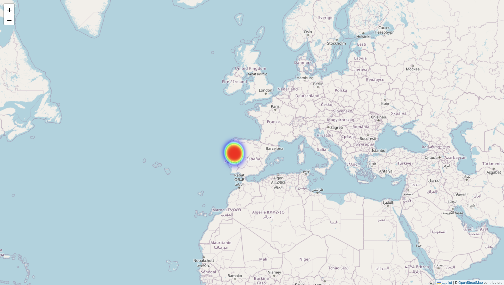

# Forest Fire Risk Prediction Project

## 🌲 Project Overview

This project implements a machine learning-based system for predicting forest fire risk using environmental and meteorological data. The system analyzes various factors such as temperature, humidity, wind speed, and fire weather indices to classify areas into fire risk categories.

## 📊 Dataset

The project uses the **Forest Fires Dataset** (`forestfires.csv`) containing 517 records with the following features:

### Features Description:
- **X, Y**: Spatial coordinates within the Montesinho park map
- **month**: Month of the year (jan-dec)
- **day**: Day of the week (mon-sun)
- **FFMC**: Fine Fuel Moisture Code (18.7-96.2)
- **DMC**: Duff Moisture Code (1.1-291.3)
- **DC**: Drought Code (7.9-860.6)
- **ISI**: Initial Spread Index (0.0-56.1)
- **temp**: Temperature in Celsius (2.2-33.3)
- **RH**: Relative Humidity (15-100)
- **wind**: Wind speed in km/h (0.4-9.4)
- **rain**: Outside rain in mm/m2 (0.0-6.4)
- **area**: Burned area of the forest (0.0-1090.84)

##  Methodology

### 1. Data Preprocessing
- **Feature Engineering**: Created binary fire risk classification (1 if area > 0, 0 otherwise)
- **Categorical Encoding**: One-hot encoded month and day variables
- **Feature Interactions**: Added temperature-wind interaction and dryness index
- **Standardization**: Applied StandardScaler to numerical features

### 2. Machine Learning Model
- **Algorithm**: Random Forest Classifier
- **Hyperparameter Tuning**: GridSearchCV with cross-validation
- **Parameters Optimized**:
  - n_estimators: [100, 150]
  - max_depth: [None, 10, 20]
  - min_samples_split: [2, 5]

### 3. Model Evaluation
- **Train/Test Split**: 80/20 split with random state 42
- **Metrics**: Accuracy, Precision, Recall, F1-Score, ROC-AUC
- **Visualizations**: Confusion Matrix, ROC Curve, Feature Importance

## Key Findings

1. **Feature Importance**: Temperature, wind speed, and fire weather indices (FFMC, DMC, DC) are the most important predictors
2. **Spatial Distribution**: Fire risk areas are concentrated in specific geographic regions
3. **Seasonal Patterns**: Higher fire risk during summer months (August-September)

## 🗺️ Visualizations

### Interactive Heatmap
The project generates an interactive heatmap (`fire_risk_heatmap.html`) showing:
- Geographic distribution of fire risk areas
- Heat intensity based on fire occurrence probability
- Zoomable and interactive map interface

### Static Visualizations
- Fire risk distribution analysis
- Correlation heatmap of features
- Model performance metrics
- Feature importance ranking

   ## 📈 Result

   **Regional Heatmap of Forest Fire Risk:**
   

   **Continental Heatmap of Forest Fire Risk:**
   

##  Usage

### Prerequisites
```bash
pip install pandas numpy scikit-learn matplotlib seaborn folium geopandas
```

### Running the Analysis
1. **Open Jupyter Notebook**:
   ```bash
   jupyter notebook forest_wildfire.ipynb
   ```

2. **Run All Cells**: Execute the notebook to perform the complete analysis

3. **View Results**:
   - Model performance metrics will be displayed
   - Visualizations will be generated
   - Interactive heatmap will be saved as HTML file

### Viewing the Heatmap
- Open `fire_risk_heatmap.html` in any web browser
- Use mouse to zoom and pan around the map
- Heat intensity indicates fire risk probability

